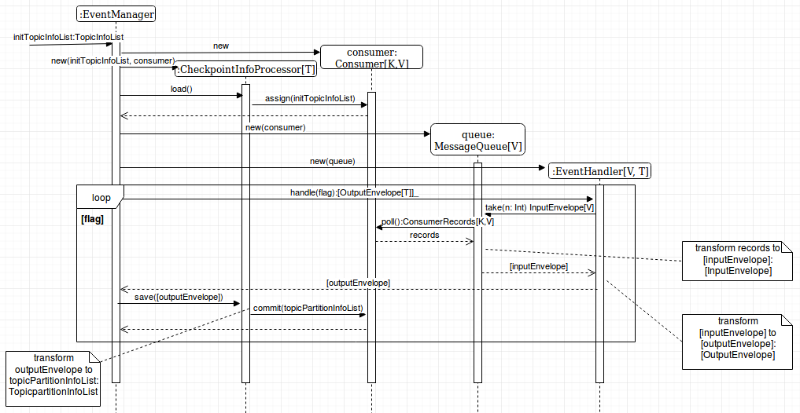

# cs-kafka-reader
Kafka CloudStack Events Reader

Common realization of wrapping KafkaConsumer for help with handling of Kafka records

Install with SBT
----------------

Add the following to your `build.sbt`
```scala
TODO: "libraryDependencies += "
```
Getting Started
---------------
Implement your instance of EventHandler and use other class such as EventManager on diagram.
See: \

where: \
    * `K` - type of ConsumerRecord key \
    * `V` - type of ConsumerRecord value \
    * `T` - type of data after handle a ConsumerRecord by the instance of EventHandler implementation \
      

Example Usage
-------------
Sample example for writing message from Kafka to console in Future:
```scala
class SimpleEventHandler(messageQueue: MessageQueue[String,String], messageCount: Int)
  extends EventHandler[String,String,Future[Unit]](messageQueue, messageCount) {

  override def handle(flag: AtomicBoolean): List[OutputEnvelope[Future[Unit]]] = {
    val inputEnvelopes = messageQueue.take(messageCount)
    inputEnvelopes.map { x =>
      OutputEnvelope[Future[Unit]](x.topic, x.partition, x.offset, Future(println(x.data)))
    }
  }

}
```
```scala
object EventManager {
    
    def main(args: Array[String]): Unit = {
          val dummyFlag = new AtomicBoolean(true)
          val consumer = new Consumer[String,String](Consumer.Settings("localhost:9092", "group01", 3000))
      
          val checkpointInfoProcessor = new CheckpointInfoProcessor[String,String,Future[Unit]](
            TopicInfoList(List(TopicInfo(topic = "topic1"))),
            consumer
          )
      
          val messageQueue = new MessageQueue[String,String](consumer)
      
          val eventHandler = new SimpleEventHandler(messageQueue, countOfMessages = 1)
      
          checkpointInfoProcessor.load()
      
          val outputEnvelopes = eventHandler.handle(dummyFlag)
          
          outputEnvelopes.data.foreach {
            case Success(x) => 
            case Failure(e) =>
              prinln(s"something went wrong, exception was thrown: $e")
              throw e
          }
          
          checkpointInfoProcessor.save(outputEnvelopes)
          consumer.close()
      }
}
```


Versioning
----------

Version of org.apache.kafka library using for it

License
-------

This project is licensed under the Apache License - see the [LICENSE](LICENSE) file for details
