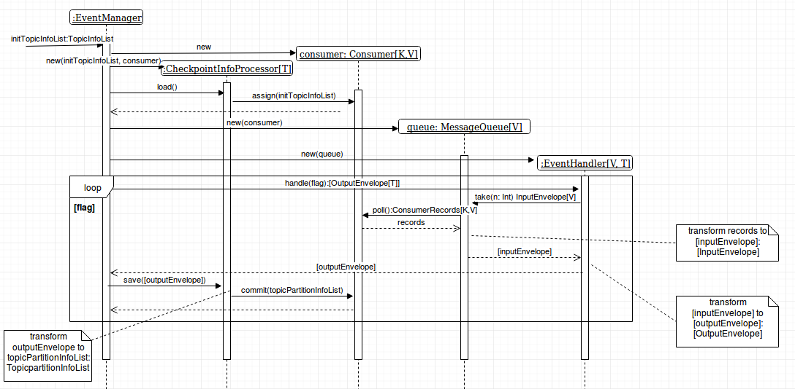

# cs-kafka-reader
Kafka CloudStack Events Reader and Evaluator Framework

The aim of the library is the convenient handling of Kafka messages. It provides the mechanisms to:
1. Buffer the messages to vary a count of processing messages without changing a consumer properties
2. Implement the logic of storing consumer offsets to any place

## Install with SBT

Add the following to your `build.sbt`
```scala
libraryDependencies += "com.bwsw" %% "kafka-reader" % "0.10.1"
```
## Getting Started

The diagram below is a simple illustration of how the library's classes should be used. \
Implement your own EventHandler and EventManager in the way as it is displayed on the diagram. \

where: \
    * `K` - type of ConsumerRecord key \
    * `V` - type of ConsumerRecord value \
    * `T` - type of data after handle a ConsumerRecord by the instance of EventHandler implementation
      

## Example Usage

The example below shows how to print messages from Kafka to the console. The call to the method is performed in Future:
```scala
class SimpleEventHandler(messageQueue: MessageQueue[String,String], messageCount: Int)
  extends EventHandler[String,String,Future[Unit]](messageQueue, messageCount) {

  override def handle(flag: AtomicBoolean): List[OutputEnvelope[Future[Unit]]] = {
    val inputEnvelopes = messageQueue.take(messageCount)
    inputEnvelopes.map { x =>
      OutputEnvelope[Future[Unit]](x.topic, x.partition, x.offset, Future(println(x.data)))
    }
  }

}
```
According to the diagram above the main class looks like this:
```scala
object EventManager {
    
    def main(args: Array[String]): Unit = {
          val dummyFlag = new AtomicBoolean(true)
          val consumer = new Consumer[String,String](Consumer.Settings("localhost:9092", "group01", 3000))
      
          val checkpointInfoProcessor = new CheckpointInfoProcessor[String,String,Future[Unit]](
            TopicInfoList(List(TopicInfo(topic = "topic1"))),
            consumer
          )
      
          val messageQueue = new MessageQueue[String,String](consumer)
      
          val eventHandler = new SimpleEventHandler(messageQueue, countOfMessages = 1)
      
          checkpointInfoProcessor.load()
      
          val outputEnvelopes = eventHandler.handle(dummyFlag)
          
          outputEnvelopes.data.foreach {
            case Success(x) => 
            case Failure(e) =>
              prinln(s"something went wrong, exception was thrown: $e")
              throw e
          }
          
          checkpointInfoProcessor.save(outputEnvelopes)
          consumer.close()
      }
}
```
## Testing

### Unit tests

Run tests: `sbt test`

### Integration tests

1. Add local environment variables:
    * `KAFKA_HOST` - host of Kafka, for example - "localhost"
    * `KAFKA_PORT` - port of Kafka, for example - "9092"
    * `KAFKA_ENDPOINTS` - $KAFKA_HOST:$KAFKA_PORT
2. Run Kafka server in docker container:
```bash
    docker run -d --rm -p 2181:2181 -p $KAFKA_PORT:$KAFKA_PORT \ 
    --env ADVERTISED_HOST=$KAFKA_HOST --env ADVERTISED_PORT=$KAFKA_PORT spotify/kafka
```
3. Run tests: `sbt it:test`

## Versioning

Library has the same version as Apache Kafka library

## License

This project is licensed under the Apache License - see the [LICENSE](LICENSE) file for details
    
